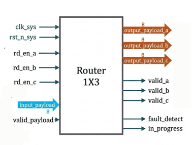
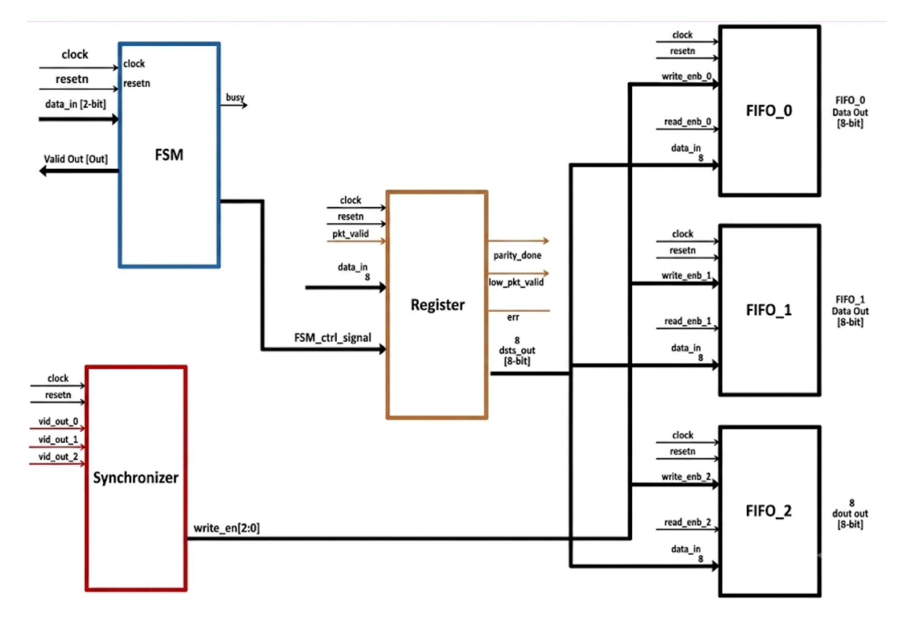
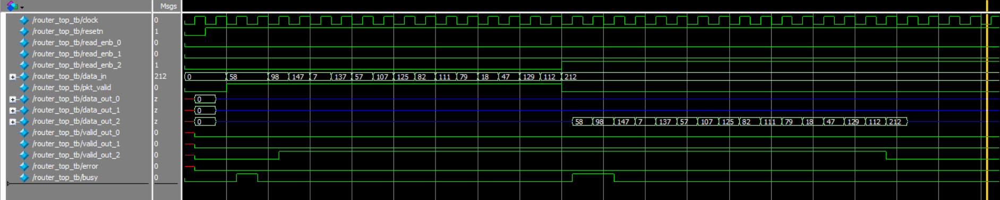

# Router 1x3 RTL Design


A synthesizable **Router 1x3** implemented in **Verilog HDL** that routes incoming network packets from a single source to one of three destination networks based on the destination address. The design follows a **packet-based communication protocol**, includes **FIFO buffering**, **flow control**, and **parity-based error detection**, making it suitable for digital design and ASIC/FPGA learning.


---


# Project Overview


The Router 1x3 receives packets from a single source network through an 8-bit data interface and forwards them to one of three destination networks. Each destination has an independent FIFO, allowing simultaneous packet reads while accepting only one packet at a time from the source.


The router supports:


- Packet-based communication

- Dynamic packet routing

- Independent FIFOs for each destination

- Flow control using **busy**

- Packet validity indication

- Parity-based error detection


---


# Top Module


The top-level module integrates all internal blocks including the FSM, Register Block, Synchronizer, and three FIFOs. It provides the complete interface between the source network and the three destination networks.


<p align="center">

   

</p>


---


# Architecture


The Router 1x3 architecture is divided into modular RTL blocks to simplify packet routing, buffering, and error detection.


<p align="center">

  

</p>


The complete design consists of:


```

Router Top

│

├── FSM Controller

├── Register Block

├── Synchronizer

├── FIFO 0

├── FIFO 1

└── FIFO 2

```


### FSM Controller


Responsible for:


- Packet reception

- Packet processing

- FIFO write control

- Busy handling

- State transitions

- Packet completion


### Register Block


Responsible for:


- Header storage

- Payload storage

- Internal parity calculation

- Parity verification

- Error generation


### Synchronizer


Responsible for:


- Destination address decoding

- FIFO selection

- Write enable generation

- FIFO full detection


### FIFO Modules


Each destination has an independent FIFO that supports:


- Packet buffering

- Independent read operation

- Full detection

- Empty detection


---


# Features


- Single source to three destination routing

- 8-bit packet interface

- Packet-based protocol

- Three independent FIFOs

- Simultaneous read from all destination FIFOs

- Busy signal for flow control

- Packet validity indication

- Parity generation and verification

- Error detection for corrupted packets

- Active-low synchronous reset

- Fully synthesizable Verilog RTL


---

## Packet Format

Each packet consists of:

| Field | Size |
|--------|------|
| Header | 1 Byte |
| Payload | 1–63 Bytes |
| Parity | 1 Byte |

### Header Format

| Bits | Description |
|------|-------------|
| [7:2] | Payload Length |
| [1:0] | Destination Address |

Destination Address Encoding:

| Address | Destination FIFO |
|----------|------------------|
| 00 | FIFO 0 |
| 01 | FIFO 1 |
| 10 | FIFO 2 |
| 11 | Invalid Address |

---

## Interface

### Inputs

| Signal | Width | Description |
|---------|------|-------------|
| clock | 1 | System clock |
| resetn | 1 | Active-low synchronous reset |
| data_in | 8 | Input packet data |
| pkt_valid | 1 | Indicates valid packet transmission |
| read_enb_0 | 1 | Read enable for FIFO 0 |
| read_enb_1 | 1 | Read enable for FIFO 1 |
| read_enb_2 | 1 | Read enable for FIFO 2 |

---

### Outputs

| Signal | Width | Description |
|---------|------|-------------|
| data_out_0 | 8 | Data output from FIFO 0 |
| data_out_1 | 8 | Data output from FIFO 1 |
| data_out_2 | 8 | Data output from FIFO 2 |
| valid_out_0 | 1 | FIFO 0 contains valid packet |
| valid_out_1 | 1 | FIFO 1 contains valid packet |
| valid_out_2 | 1 | FIFO 2 contains valid packet |
| busy | 1 | Router busy indication |
| error | 1 | Parity mismatch detected |

---


# Working Principle


## Packet Reception


- Source transmits one byte every clock cycle.

- First byte is the packet header.

- `pkt_valid` remains HIGH during header and payload.

- `pkt_valid` becomes LOW while sending the parity byte.


## Routing


The router decodes the destination address from the header.


- `00` → FIFO 0

- `01` → FIFO 1

- `10` → FIFO 2


## Flow Control


When the selected FIFO becomes full,


```

busy = 1

```


The source pauses transmission until the router is ready.


## Packet Read


Each destination monitors


```

valid_out_x

```


When asserted,


```

read_enb_x

```


is enabled to receive packet data.


## Error Detection


The Register block continuously computes packet parity.


```

Received Parity == Calculated Parity ?

```


- Match → Packet accepted

- Mismatch → `error` asserted


---


# Simulation Result


The waveform below demonstrates successful packet transmission through the router. The packet is received at the input, routed to the selected destination FIFO, and read correctly while maintaining protocol timing. Busy, valid, and error signals operate as expected.


<p align="center">

  

</p>


The simulation verifies:


- Correct packet reception

- Destination address decoding

- FIFO write/read operation

- Valid output generation

- Busy signal assertion during packet processing

- Successful parity verification

- Error-free packet routing


---


# Simulation


The design can be simulated using:


- ModelSim

- QuestaSim

- Xilinx Vivado Simulator

- Cadence Xcelium

- Synopsys VCS

- Icarus Verilog


Example:


```bash

iverilog *.v

vvp a.out

gtkwave dump.vcd

```


---


# Applications


- Network-on-Chip (NoC)

- FPGA Communication Systems

- Packet Switching

- Digital Communication

- ASIC Design Learning

- RTL Design Practice


---


# Author


**Manoj R**


Aspiring RTL Design / VLSI Engineer


- Verilog HDL

- Digital Design

- FPGA Development

- ASIC Front-End Design
